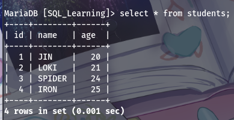

SQL-Roadmap
# CREATEING TABLE #
 CREATE TABLE students (
 id INT PRIMARY KEY,
    name VARCHAR(50),
    age INT
    );
# INSERTING DATA #
INSTERT INTO students (id,name,age)
values (1,'JIN',20);
# ACCESSING DATA #
SELECT * FROM students;

